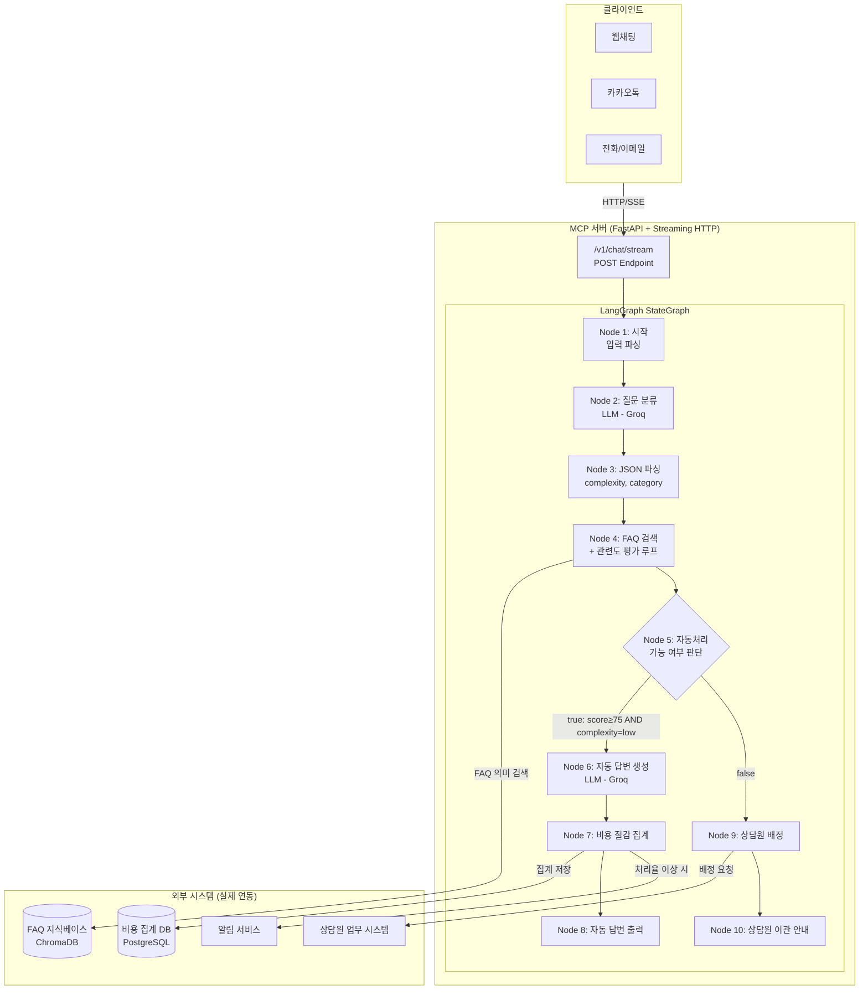

# AI Agent 개발계획서

> 프로젝트: 고객센터 운영 비용 최적화 에이전트
> 작성일: 2026-03-26
> 기반: DSL `cs-cost-optimizer.dsl.yaml` (검증 완료), 시나리오 `scenario.md` (버전 3, 비용 절감 관점)

---

## 1. 개요

### 1.1 프로젝트명

고객센터 운영 비용 최적화 에이전트 (CS Cost Optimizer Agent)

### 1.2 목적

FAQ 자동 응답으로 상담원 투입 건수를 최소화하고, 처리 건수 대비 운영 비용을 지속적으로 낮추며
고객센터 규모를 효율적으로 유지하는 비용 절감 에이전트 구현

### 1.3 범위

| 구분 | 포함 범위 |
|------|-----------|
| 핵심 기능 | 질문 분류 → FAQ 검색 + 관련도 평가 → 자동 답변 또는 상담원 이관 |
| 비용 집계 | 자동 처리 건당 절감 비용 계산 및 누적 집계 |
| 상담원 배정 | 복잡도/긴급도 기반 우선순위 대기열 등록 |
| 모니터링 | 자동 처리율 일별 추적, 이상 지표 알림 발송 |
| 제외 범위 | 경영진 보고 UI, FAQ 저장소 관리 도구, 상담원 업무 시스템 백엔드 |

### 1.4 기대 효과

| 지표 | As-Is | To-Be | 절감율 |
|------|-------|-------|-------|
| 상담원 인원 | 10명 | 4명 | 60% 감소 |
| 월 운영 비용 | 2,800만 원 | 1,120만 원 | 60% 절감 |
| 연간 절감액 | — | 약 2억 원 | — |
| 성수기 임시 채용 | 발생 | 제거 | 100% 절감 |

### 1.5 DSL → 프로덕션 전환 전략

Dify 플랫폼 기반 프로토타입(advanced-chat 모드)을 Python + LangChain/LangGraph 기반 프로덕션 코드로 전환.
DSL의 노드 구조를 LangGraph StateGraph의 노드로 1:1 매핑하여 동일한 워크플로우 로직을 재현함.
MOCK 코드 노드는 실제 외부 시스템 연동 모듈로 교체함.

---

## 2. 기술스택

### 2.1 언어 및 프레임워크

| 구분 | 기술 | 버전 | 선택 근거 |
|------|------|------|----------|
| 언어 | Python | 3.11+ | DSL 코드 노드가 python3 기반, 팀 역량 보유 |
| AI 오케스트레이션 | LangChain | 0.3.x | LLM 프롬프트 체인, 도구 연동 추상화 |
| 워크플로우 | LangGraph | 0.2.x | DSL 노드/엣지 구조를 StateGraph로 직접 매핑 |
| API 서버 | FastAPI | 0.115.x | Streaming HTTP 지원, MCP 서버 구조 적합 |
| LLM | Groq (meta-llama/llama-4-scout-17b-16e-instruct) | — | DSL 검증 모델 동일 사용 |

### 2.2 라이브러리

| 분류 | 라이브러리 | 용도 |
|------|-----------|------|
| LLM 클라이언트 | `langchain-groq` | Groq API 연동 |
| 벡터 검색 | `langchain-community`, `chromadb` | FAQ 의미 검색 |
| 임베딩 | `sentence-transformers` | FAQ 문서 임베딩 |
| 데이터 검증 | `pydantic` v2 | 입출력 스키마 검증 |
| 환경 설정 | `python-dotenv` | API Key 관리 |
| HTTP 클라이언트 | `httpx` | 외부 시스템 연동 |
| 스트리밍 | `sse-starlette` | Server-Sent Events 지원 |
| 로깅 | `structlog` | 구조화 로그 출력 |
| 테스트 | `pytest`, `pytest-asyncio` | 단위/통합 테스트 |

### 2.3 인프라

| 구분 | 기술 | 용도 |
|------|------|------|
| 컨테이너 | Docker 24.x | 애플리케이션 패키징 |
| 컨테이너 오케스트레이션 | Docker Compose | 로컬/스테이징 멀티 컨테이너 관리 |
| 벡터 DB | ChromaDB (컨테이너) | FAQ 임베딩 저장소 |
| 집계 DB | SQLite → PostgreSQL | 처리 이력 및 비용 집계 저장 |
| 모니터링 | Prometheus + Grafana | 처리율, 응답 시간 대시보드 |
| CI/CD | GitHub Actions | 빌드, 테스트, 배포 자동화 |

---

## 3. 아키텍처

### 3.1 시스템 구성도



### 3.2 컴포넌트 구성

| 컴포넌트 | 역할 | 대응 DSL 노드 |
|---------|------|-------------|
| `InputParser` | 입력 파라미터 파싱 및 검증 | Node 1 (시작) |
| `QuestionClassifier` | LLM 기반 복잡도/카테고리 분류 | Node 2 (질문 분류) |
| `JSONParser` | LLM 출력 JSON 파싱 | Node 3 (JSON 파싱) |
| `FAQSearchEngine` | 의미 검색 + 관련도 평가 루프 | Node 4 (FAQ 검색 + 관련도 평가) |
| `AutoProcessDecider` | 자동처리 가능 여부 조건 판단 | Node 5 (자동처리 가능 여부) |
| `AutoAnswerGenerator` | LLM 기반 자동 답변 생성 | Node 6 (자동 답변 생성) |
| `CostAggregator` | 건당 절감 비용 계산 및 집계 | Node 7 (비용 절감 집계) |
| `AutoAnswerOutput` | 자동 답변 스트리밍 출력 | Node 8 (자동 답변) |
| `AgentAssigner` | 복잡도/긴급도 기반 상담원 배정 | Node 9 (상담원 배정) |
| `EscalationOutput` | 상담원 이관 안내 출력 | Node 10 (상담원 이관 안내) |

### 3.3 데이터 흐름

```
고객 질문 입력
  → [InputParser] inquiry_channel, query, mock_preset 파싱
  → [QuestionClassifier] LLM → {"complexity": "low/high", "category": "카테고리명"}
  → [JSONParser] complexity, category 변수 분리
  → [FAQSearchEngine] 의미 검색 → 관련도 평가 → 90점 미만 시 질문 수정 재검색 (최대 3회)
  → [AutoProcessDecider] top_score≥75 AND complexity=low ?
      → true: [AutoAnswerGenerator] LLM → 200자 이내 답변
              [CostAggregator] 28,000원/건 절감 집계
              [AutoAnswerOutput] SSE 스트리밍 출력
      → false: [AgentAssigner] 복잡도/긴급도 기반 우선순위 배정
               [EscalationOutput] 대기 시간 + 배정 상담원 안내
```

---

## 4. 모듈 설계

### 4.1 핵심 워크플로우

#### 디렉토리 구조

```
cs-agent/
├── app/
│   ├── main.py                  # FastAPI 엔트리포인트
│   ├── graph/
│   │   ├── state.py             # LangGraph StateGraph 상태 정의
│   │   ├── workflow.py          # 워크플로우 그래프 조립
│   │   └── nodes/
│   │       ├── classifier.py    # Node 2: 질문 분류 (LLM)
│   │       ├── json_parser.py   # Node 3: JSON 파싱
│   │       ├── faq_search.py    # Node 4: FAQ 검색 + 관련도 평가
│   │       ├── decider.py       # Node 5: 자동처리 가능 여부
│   │       ├── answer_gen.py    # Node 6: 자동 답변 생성 (LLM)
│   │       ├── cost_agg.py      # Node 7: 비용 절감 집계
│   │       ├── auto_output.py   # Node 8: 자동 답변 출력
│   │       ├── agent_assign.py  # Node 9: 상담원 배정
│   │       └── escalation.py    # Node 10: 상담원 이관 안내
│   ├── tools/
│   │   ├── faq_kb.py            # FAQ 지식베이스 의미 검색 도구
│   │   ├── cost_tracker.py      # 비용 집계 외부 연동
│   │   ├── agent_queue.py       # 상담원 대기열 관리 연동
│   │   └── notifier.py          # 알림 발송 연동
│   ├── api/
│   │   ├── routes.py            # API 엔드포인트 정의
│   │   └── schemas.py           # Pydantic 입출력 스키마
│   ├── config/
│   │   └── settings.py          # 환경 설정 (API Key, 임계값 등)
│   └── monitoring/
│       └── metrics.py           # Prometheus 메트릭 수집
├── tests/
│   ├── unit/                    # 단위 테스트
│   ├── integration/             # 통합 테스트
│   └── scenarios/               # 시나리오 테스트 (E2E)
├── Dockerfile
├── docker-compose.yml
└── pyproject.toml
```

#### LangGraph 상태 스키마 (`graph/state.py`)

```
AgentState:
  # 입력
  query: str                    # 고객 질문 (sys.query)
  inquiry_channel: str          # 문의 채널
  mock_preset: str              # MOCK 프리셋
  mock_override: str            # MOCK 오버라이드

  # Node 3 출력
  complexity: str               # "low" | "high"
  category: str                 # 카테고리명

  # Node 4 출력
  faq_results: str              # JSON 문자열 (FAQ 검색 결과)
  top_score: float              # 최고 관련도 점수
  search_attempts: int          # 검색 시도 횟수
  evaluation_log: str           # 평가 로그 JSON

  # Node 5 라우팅
  auto_processable: bool        # 자동처리 가능 여부

  # Node 6 출력
  generated_answer: str         # LLM 생성 답변

  # Node 7 출력
  saved_cost: int               # 건당 절감 비용
  cost_note: str                # 절감 비용 안내 문구
  total_saved_today: int        # 당일 누적 절감액

  # Node 9 출력
  agent_id: str                 # 배정 상담원 ID
  agent_name: str               # 배정 상담원 이름
  estimated_wait_minutes: int   # 예상 대기 시간
  queue_position: int           # 대기 순서
  priority: str                 # 우선순위
```

#### 워크플로우 그래프 조립 (`graph/workflow.py`)

| 단계 | 엣지 | 조건 |
|------|------|------|
| START → classifier | 무조건 | — |
| classifier → json_parser | 무조건 | — |
| json_parser → faq_search | 무조건 | — |
| faq_search → decider | 무조건 | — |
| decider → answer_gen | 조건부 | top_score≥75 AND complexity=low |
| decider → agent_assign | 조건부 | 위 조건 불충족 |
| answer_gen → cost_agg | 무조건 | — |
| cost_agg → auto_output | 무조건 | — |
| auto_output → END | 무조건 | — |
| agent_assign → escalation | 무조건 | — |
| escalation → END | 무조건 | — |

### 4.2 입출력 인터페이스

#### 입력 인터페이스

- **프로토콜**: HTTP POST + SSE (Server-Sent Events) 스트리밍
- **엔드포인트**: `POST /v1/chat/stream`
- **Content-Type**: `application/json`
- **응답 형식**: `text/event-stream`

#### 출력 인터페이스

- **자동 답변 경로**: SSE 스트림 → `event: message` 토큰 단위 스트리밍
- **이관 안내 경로**: SSE 스트림 → `event: message` 단일 응답
- **메타데이터**: `event: metadata` → 처리 유형, 절감 비용, 검색 시도 횟수 포함

### 4.3 외부 도구 연동

#### FAQ 지식베이스 의미 검색 (`tools/faq_kb.py`)

| 항목 | 내용 |
|------|------|
| 기능 | 질문 텍스트 임베딩 → ChromaDB 유사도 검색 → 관련도 점수 반환 |
| 입력 | query: str, category: str, top_k: int = 5 |
| 출력 | results: List[{title, content, score}], top_score: float |
| 전환 | DSL Node 4 MOCK search_faq() → 실제 ChromaDB 벡터 검색으로 교체 |
| 관련도 임계값 | 90점 이상: 즉시 반환 / 미만: 질문 수정 재검색 (최대 3회) |

#### 비용 집계 (`tools/cost_tracker.py`)

| 항목 | 내용 |
|------|------|
| 기능 | 자동 처리 완료 시 건당 절감 비용 계산 및 PostgreSQL 집계 테이블에 저장 |
| 입력 | category: str, channel: str |
| 출력 | saved_cost: int, total_saved_today: int, auto_processed_today: int |
| 단가 | 28,000원/건 (상담원 1건 처리 비용 기준) |
| 전환 | DSL Node 7 MOCK presets → 실제 DB INSERT/SELECT로 교체 |

#### 상담원 대기열 관리 (`tools/agent_queue.py`)

| 항목 | 내용 |
|------|------|
| 기능 | 복잡도/긴급도 기반 우선순위 산정 → 상담원 업무 시스템 API 호출 → 대기열 등록 |
| 입력 | category: str, complexity: str |
| 출력 | agent_id, agent_name, queue_position, estimated_wait_minutes, priority, status |
| 우선순위 규칙 | complexity=high → priority=high, 예상 대기 시간 2분 단축 |
| 전환 | DSL Node 9 MOCK presets → 실제 상담원 시스템 REST API 호출로 교체 |

#### 알림 발송 (`tools/notifier.py`)

| 항목 | 내용 |
|------|------|
| 기능 | 운영 이상 지표 감지 시 관리자 알림 발송 (이메일/Slack) |
| 트리거 | 자동 처리율 60% 미만, 특정 FAQ 오답 3회 연속 발생 |
| 입력 | alert_type: str, message: str, recipients: List[str] |
| 출력 | success: bool, sent_at: datetime |

### 4.4 에러 핸들링

| 오류 유형 | 발생 위치 | 처리 방법 |
|----------|----------|----------|
| LLM 응답 JSON 파싱 실패 | Node 3 (JSON 파싱) | complexity="high", category="기타" 기본값으로 폴백 |
| FAQ 검색 3회 모두 90점 미만 | Node 4 (FAQ 검색) | 최고 점수 결과 반환, 자동처리 가능 여부 판단 계속 진행 |
| Groq API 타임아웃 | Node 2, Node 6 | 재시도 2회 → 실패 시 상담원 이관 경로로 폴백 |
| 상담원 배정 시스템 오류 | Node 9 (상담원 배정) | status="system_error" 반환, 고객에게 재시도 안내 |
| 비용 집계 DB 연결 실패 | Node 7 (비용 집계) | 로컬 캐시에 임시 저장 후 재시도 큐에 등록 |
| 입력 검증 실패 | InputParser | HTTP 422 반환, 누락 필드 명시 |

#### 에러 응답 표준 형식

```json
{
  "error": {
    "code": "ERROR_CODE",
    "message": "사용자 친화적 메시지",
    "details": "기술적 상세 정보 (내부 로그용)"
  }
}
```

### 4.5 개발 순서 및 일정

| 단계 | 모듈 | 기간 | 의존성 |
|------|------|------|-------|
| Phase 1 | 프로젝트 골격 설정 (pyproject.toml, Docker, 환경 설정) | 0.5일 | — |
| Phase 2 | LangGraph StateGraph + 워크플로우 조립 (`graph/state.py`, `graph/workflow.py`) | 1일 | Phase 1 |
| Phase 3 | Node 2, 3: 질문 분류 + JSON 파싱 (`classifier.py`, `json_parser.py`) | 1일 | Phase 2 |
| Phase 4 | Node 4: FAQ 검색 + 관련도 평가 루프 (`faq_search.py`, ChromaDB 연동) | 1.5일 | Phase 3 |
| Phase 5 | Node 5: 자동처리 결정 + Node 6: 자동 답변 생성 (`decider.py`, `answer_gen.py`) | 1일 | Phase 4 |
| Phase 6 | Node 7: 비용 집계 + Node 8: 자동 답변 출력 (`cost_agg.py`, `auto_output.py`) | 1일 | Phase 5 |
| Phase 7 | Node 9, 10: 상담원 배정 + 이관 안내 (`agent_assign.py`, `escalation.py`) | 1일 | Phase 4 |
| Phase 8 | FastAPI 엔드포인트 + SSE 스트리밍 (`api/routes.py`, `api/schemas.py`) | 1일 | Phase 6, 7 |
| Phase 9 | 알림 발송 모듈 (`tools/notifier.py`) | 0.5일 | Phase 8 |
| Phase 10 | 단위/통합/시나리오 테스트 작성 및 실행 | 2일 | Phase 8 |
| Phase 11 | Docker 빌드, CI/CD 파이프라인, 배포 설정 | 1일 | Phase 10 |
| **합계** | | **11.5일** | |

---

## 5. 프롬프트 최적화

### 5.1 현황 분석

#### Node 2 — 질문 분류 프롬프트

| 항목 | 현황 |
|------|------|
| 역할 정의 | "고객 문의 분류 전문가" — 명확함 |
| 분류 기준 | complexity(low/high), category(6종) — 명시적 정의 |
| 응답 형식 | JSON 강제 출력 지시 — 적절 |
| 입력 변수 | `{{#1.inquiry_channel#}}`, `{{#sys.query#}}` — 채널 컨텍스트 포함 |
| 문제점 | 복잡도 판단 기준이 예시 수준으로 모호함 (결제 분쟁 vs 단순 결제 문의 구분 불명확) |
| 문제점 | JSON 외 텍스트 포함 시 Node 3에서 파싱 실패 위험 (현재 방어 코드 존재하나 LLM 레벨에서 제어 필요) |
| 문제점 | temperature=0.1로 낮게 설정되어 있으나 JSON 형식 강제를 위해 structured output 미사용 |

#### Node 6 — 자동 답변 생성 프롬프트

| 항목 | 현황 |
|------|------|
| 역할 정의 | "비용 효율을 최우선으로 하는 자동 응답 에이전트" — 명확함 |
| 응답 제약 | 200자 이내, 불필요한 인사 금지, 추측 답변 금지 — 적절 |
| FAQ 컨텍스트 | `{{#4.result#}}` — JSON 문자열 형태로 전달 |
| 문제점 | FAQ 결과가 JSON 문자열로 전달되어 LLM이 구조를 파악하기 어려움 |
| 문제점 | 200자 기준이 토큰 단위인지 문자 단위인지 불명확 |
| 문제점 | 다회 검색 시도 맥락(search_attempts, evaluation_log)이 프롬프트에 미전달 |

### 5.2 최적화 방향

#### Node 2 — 질문 분류 프롬프트 최적화

| 방향 | 내용 |
|------|------|
| 분류 기준 구체화 | low: 제품 사용법, 배송 조회, 정책 안내, 단순 계정 설정 / high: 환불 분쟁, 결제 오류, 개인정보 관련, 복합 문의 |
| Structured Output 적용 | LangChain `with_structured_output(ClassificationResult)` 사용으로 JSON 파싱 오류 원천 차단 |
| Few-shot 예시 추가 | low/high 각 3건씩 예시 포함하여 엣지케이스 분류 정확도 향상 |
| 카테고리 확장 검토 | 현재 6종 카테고리를 처리율 데이터 기반으로 동적 확장 가능 구조로 설계 |

#### Node 6 — 자동 답변 생성 프롬프트 최적화

| 방향 | 내용 |
|------|------|
| FAQ 컨텍스트 형식 개선 | JSON 문자열 대신 마크다운 구조화 형식으로 변환 후 전달 |
| 글자 수 기준 명확화 | "200자(한국어 기준) 이내, 약 2-3문장" 으로 명시 |
| 검색 맥락 전달 | search_attempts > 1인 경우 "여러 번 검색 후 최적 결과" 컨텍스트 포함 |
| 답변 품질 가드레일 | 답변 신뢰도 점수(top_score)를 시스템 프롬프트에 포함하여 low_score 시 불확실성 표현 유도 |

### 5.3 기대 효과

| 최적화 항목 | 기대 효과 |
|-----------|----------|
| Structured Output 적용 | JSON 파싱 오류율 0% 목표 (현재 방어 코드 의존 제거) |
| 분류 기준 구체화 | 분류 정확도 5-10% 향상, 오분류로 인한 오답률 감소 |
| FAQ 컨텍스트 형식 개선 | 답변 품질 향상, 200자 준수율 향상 |
| 검색 맥락 전달 | 낮은 점수 검색 결과 기반 답변의 불확실성 표현으로 오답률 감소 |

---

## 6. API 설계서

### 6.1 엔드포인트 목록

| 메서드 | 경로 | 설명 | 인증 |
|-------|------|------|------|
| POST | `/v1/chat/stream` | 고객 질문 처리 (SSE 스트리밍) | API Key |
| GET | `/v1/metrics/daily` | 당일 처리 현황 및 절감 비용 조회 | API Key |
| GET | `/v1/metrics/monthly` | 월별 집계 보고서 조회 | API Key |
| GET | `/health` | 서비스 헬스체크 | 없음 |
| GET | `/metrics` | Prometheus 메트릭 | 내부망 전용 |

### 6.2 주요 엔드포인트 상세

#### `POST /v1/chat/stream`

**요청 스키마**

```json
{
  "query": "충전 케이블 연결 방법을 알려주세요",
  "inquiry_channel": "웹채팅",
  "mock_preset": "default",
  "mock_override": ""
}
```

| 필드 | 타입 | 필수 | 설명 |
|------|------|------|------|
| query | string | 필수 | 고객 질문 텍스트 |
| inquiry_channel | enum | 필수 | 웹채팅 \| 카카오톡 \| 전화 \| 이메일 |
| mock_preset | enum | 선택 | default \| empty \| error \| timeout (기본: default) |
| mock_override | string | 선택 | MOCK 오버라이드 JSON 문자열 |

**SSE 응답 이벤트**

```
event: message
data: {"type": "token", "content": "전원 버튼을 3초간 누르시면"}

event: message
data: {"type": "token", "content": " LED가 점멸하며 연결 준비가 완료됩니다."}

event: metadata
data: {
  "process_type": "auto",
  "category": "제품사용",
  "complexity": "low",
  "top_score": 88,
  "search_attempts": 1,
  "saved_cost": 28000,
  "cost_note": "자동 처리 1건 절감액: 28,000원",
  "elapsed_ms": 3200
}

event: done
data: {}
```

**이관 안내 응답 이벤트**

```
event: message
data: {"type": "escalation", "content": "해당 문의는 전문 상담원의 도움이 필요합니다."}

event: metadata
data: {
  "process_type": "escalation",
  "agent_id": "AGT-042",
  "agent_name": "김상담",
  "queue_position": 2,
  "estimated_wait_minutes": 5,
  "priority": "normal"
}

event: done
data: {}
```

#### `GET /v1/metrics/daily`

**응답 스키마**

```json
{
  "date": "2026-03-26",
  "total_inquiries": 1000,
  "auto_processed": 720,
  "auto_rate": 72.0,
  "escalated": 280,
  "total_saved_today": 20160000,
  "avg_response_ms": 3500,
  "alert_triggered": false
}
```

### 6.3 에러 코드

| HTTP 상태 | 에러 코드 | 설명 |
|----------|----------|------|
| 400 | `INVALID_CHANNEL` | 지원하지 않는 문의 채널 |
| 400 | `EMPTY_QUERY` | 질문 텍스트 없음 |
| 401 | `UNAUTHORIZED` | API Key 인증 실패 |
| 422 | `VALIDATION_ERROR` | 입력 스키마 검증 실패 |
| 503 | `LLM_UNAVAILABLE` | Groq API 연결 실패 |
| 503 | `FAQ_SEARCH_FAILED` | FAQ 검색 시스템 연결 실패 |
| 503 | `AGENT_SYSTEM_ERROR` | 상담원 배정 시스템 오류 |
| 504 | `PROCESSING_TIMEOUT` | 처리 시간 초과 (30초) |

---

## 7. 데이터 모델

### 7.1 입력 스키마

```
ChatRequest:
  query: str                        # 고객 질문 (1-1000자)
  inquiry_channel: InquiryChannel   # Enum: 웹채팅, 카카오톡, 전화, 이메일
  mock_preset: MockPreset           # Enum: default, empty, error, timeout (기본: default)
  mock_override: Optional[str]      # JSON 문자열 (최대 1000자)
```

### 7.2 중간 데이터 구조

```
ClassificationResult:               # Node 3 출력 (Structured Output)
  complexity: Literal["low", "high"]
  category: str                     # 제품사용, 배송, 결제, 환불, 계정, 기타

FAQSearchResult:                    # Node 4 출력
  results: List[FAQItem]
  top_score: float                  # 0-100
  count: int
  search_attempts: int              # 1-3
  evaluation_log: List[SearchAttempt]

FAQItem:
  title: str                        # FAQ-{category}-{seq}
  content: str
  score: float                      # 0-100

SearchAttempt:
  attempt: int
  query: str
  relevance: float
  top_score: float
  count: int

CostAggregation:                    # Node 7 출력
  saved_cost: int                   # 건당 절감액 (원)
  auto_processed: int               # 처리 건수 (1)
  total_saved_today: int            # 당일 누적 절감액 (원)
  total_auto_today: int             # 당일 누적 자동 처리 건수
  cost_note: str                    # 절감액 안내 문구

AgentAssignment:                    # Node 9 출력
  agent_id: str                     # AGT-{3자리}
  agent_name: str
  queue_position: int
  estimated_wait_minutes: int
  priority: Literal["normal", "high"]
  status: Literal["queued", "no_agent_available", "system_error", "timeout"]
```

### 7.3 출력 스키마

```
AutoAnswerResponse (SSE):
  tokens: List[str]                 # 스트리밍 토큰 목록
  metadata: AutoAnswerMetadata

AutoAnswerMetadata:
  process_type: Literal["auto"]
  category: str
  complexity: str
  top_score: float
  search_attempts: int
  saved_cost: int
  cost_note: str
  elapsed_ms: int

EscalationResponse (SSE):
  message: str                      # 이관 안내 문구
  metadata: EscalationMetadata

EscalationMetadata:
  process_type: Literal["escalation"]
  agent_id: str
  agent_name: str
  queue_position: int
  estimated_wait_minutes: int
  priority: str

DailyMetricsResponse:
  date: date
  total_inquiries: int
  auto_processed: int
  auto_rate: float                  # 백분율 (%)
  escalated: int
  total_saved_today: int            # 원
  avg_response_ms: int
  alert_triggered: bool
```

### 7.4 DB 테이블 구조

```
processing_history:
  id: UUID (PK)
  query_hash: str                   # 개인정보 보호: 쿼리 해시만 저장
  inquiry_channel: str
  category: str
  complexity: str
  process_type: str                 # "auto" | "escalation"
  top_score: float
  search_attempts: int
  saved_cost: int
  elapsed_ms: int
  created_at: datetime

daily_cost_summary:
  date: date (PK)
  total_inquiries: int
  auto_processed: int
  total_saved: int
  avg_response_ms: float
  alert_triggered: bool
  updated_at: datetime
```

---

## 8. 테스트 전략

### 8.1 단위 테스트 (`tests/unit/`)

| 대상 모듈 | 테스트 항목 | 도구 |
|----------|-----------|------|
| `json_parser.py` | 정상 JSON 파싱, JSON 추출 (부가 텍스트 포함), 파싱 실패 시 기본값 반환 | pytest |
| `decider.py` | top_score≥75 AND low → True, score<75 → False, high complexity → False | pytest |
| `cost_agg.py` | 28,000원/건 계산, 누적 집계, empty/error/timeout 프리셋 처리 | pytest |
| `agent_assign.py` | high complexity 시 priority 승격, wait_time 2분 단축 | pytest |
| `faq_search.py` | 관련도 90점 이상 즉시 반환, 3회 루프 후 최고 점수 결과 반환 | pytest |
| `schemas.py` | Pydantic 검증: 필수 필드 누락, 잘못된 enum 값 | pytest |

**목표 커버리지**: 라인 커버리지 80% 이상

### 8.2 통합 테스트 (`tests/integration/`)

| 테스트 항목 | 검증 내용 | 도구 |
|-----------|----------|------|
| 자동 답변 워크플로우 E2E | Node 1~8 전체 실행 → SSE 응답 수신, metadata 포함 여부 | pytest + httpx |
| 이관 워크플로우 E2E | Node 1~5, 9~10 전체 실행 → 이관 안내 응답 수신 | pytest + httpx |
| LLM 연동 통합 | Groq API 실제 호출 → 분류 결과 JSON 형식 검증 | pytest (GROQ_API_KEY 필요) |
| ChromaDB 연동 통합 | FAQ 임베딩 저장 → 의미 검색 → 관련도 점수 반환 | pytest + ChromaDB |
| 비용 집계 DB 통합 | 처리 완료 → DB 저장 → daily_cost_summary 업데이트 | pytest + PostgreSQL |
| API 에러 핸들링 | 각 에러 코드별 HTTP 상태 코드 및 응답 형식 검증 | pytest + httpx |

### 8.3 시나리오 테스트 (`tests/scenarios/`)

시나리오 문서(scenario.md) 섹션 8 기반 E2E 검증

#### 정상 케이스

| 시나리오 | 입력 | 검증 항목 |
|---------|------|----------|
| SC-01: 단순 FAQ 자동 처리 | query="충전 케이블 연결 방법", channel="웹채팅" | 8초 이내 응답, 200자 이내 답변, saved_cost=28000 집계 확인 |
| SC-02: 고복잡도 이관 | query="환불 분쟁 건", complexity=high | 이관 안내 응답, agent_id 배정, 20초 이내 처리 확인 |
| SC-03: FAQ 재검색 루프 | 첫 검색 결과 top_score=60 반환 MOCK | search_attempts=2 이상, 최종 best_score 반환 확인 |
| SC-04: 처리율 70% 검증 | 100건 시뮬레이션 (MOCK 프리셋 혼합) | auto_rate ≥ 70% 확인 |

#### 예외 케이스

| 시나리오 | 입력 | 검증 항목 |
|---------|------|----------|
| SC-E01: 처리율 60% 미만 알림 | auto_rate=55% 시뮬레이션 | 알림 발송 함수 호출 확인, 미매칭 유형 분석 로그 생성 |
| SC-E02: FAQ 오답 3회 연속 | 동일 FAQ 항목 오답 3회 주입 | 해당 항목 비활성화 API 호출 확인, 검토 요청 알림 발송 |
| SC-E03: Groq API 타임아웃 | LLM 응답 타임아웃 MOCK | 재시도 2회 후 이관 경로 폴백 확인 |
| SC-E04: 상담원 시스템 오류 | agent_queue MOCK error 프리셋 | status="system_error" 반환, 고객 재시도 안내 확인 |

### 8.4 성능 테스트

| 항목 | 목표값 | 도구 |
|------|-------|------|
| 자동 답변 응답 시간 | 8초 이내 (P95) | locust |
| 상담원 이관 등록 시간 | 20초 이내 (P95) | locust |
| 동시 처리 | 100 TPS 이상 | locust |

---

## 9. 배포 계획

### 9.1 배포 환경

#### 로컬 환경

| 항목 | 내용 |
|------|------|
| 목적 | 개발 및 단위 테스트 |
| 구성 | Docker Compose: app + chromadb + postgres |
| 기동 방법 | `docker-compose up -d` |
| 데이터 | MOCK 프리셋 사용, 실제 Groq API 연결 |

#### 스테이징 환경

| 항목 | 내용 |
|------|------|
| 목적 | 통합 테스트 및 QA 검증 |
| 구성 | Docker Compose: app + chromadb + postgres + prometheus + grafana |
| 데이터 | 실제 FAQ 샘플 데이터 적재, 실제 외부 시스템 연동 |
| 접근 제어 | VPN 내부망 제한 |

#### 프로덕션 환경

| 항목 | 내용 |
|------|------|
| 목적 | 운영 서비스 |
| 구성 | Docker Compose 또는 Kubernetes (규모에 따라 결정) |
| 스케일링 | 컨테이너 수평 확장 (stateless 설계) |
| 데이터 | 실제 FAQ 지식베이스, PostgreSQL 운영 DB |
| 접근 제어 | API Key 인증, HTTPS 필수 |

### 9.2 Docker 구성

#### `Dockerfile` (Multi-stage Build)

```
Stage 1 (builder):
  - python:3.11-slim 기반
  - pyproject.toml 의존성 설치

Stage 2 (runtime):
  - python:3.11-slim 기반
  - builder에서 패키지만 복사
  - 비루트 사용자 실행 (보안)
  - EXPOSE 8000
  - CMD: uvicorn app.main:app --host 0.0.0.0 --port 8000
```

#### `docker-compose.yml` 서비스 구성

| 서비스 | 이미지 | 포트 | 용도 |
|-------|-------|------|------|
| app | 로컬 빌드 | 8000 | FastAPI 애플리케이션 |
| chromadb | chromadb/chroma:latest | 8001 | FAQ 벡터 DB |
| postgres | postgres:16-alpine | 5432 | 처리 이력 및 집계 DB |
| prometheus | prom/prometheus:latest | 9090 | 메트릭 수집 |
| grafana | grafana/grafana:latest | 3000 | 모니터링 대시보드 |

### 9.3 환경 변수 (`.env`)

| 변수명 | 설명 | 보안 수준 |
|-------|------|----------|
| `GROQ_API_KEY` | Groq API 인증 키 | 시크릿 |
| `API_KEY` | 서비스 API 인증 키 | 시크릿 |
| `CHROMADB_HOST` | ChromaDB 호스트 | 설정 |
| `POSTGRES_DSN` | PostgreSQL 연결 문자열 | 시크릿 |
| `AGENT_SYSTEM_API_URL` | 상담원 업무 시스템 API URL | 설정 |
| `NOTIFY_WEBHOOK_URL` | 알림 Webhook URL | 시크릿 |
| `AUTO_RATE_ALERT_THRESHOLD` | 자동 처리율 알림 임계값 (기본: 60) | 설정 |
| `FAQ_SCORE_THRESHOLD` | FAQ 자동처리 점수 임계값 (기본: 75) | 설정 |
| `MAX_SEARCH_ATTEMPTS` | 최대 재검색 횟수 (기본: 3) | 설정 |

### 9.4 CI/CD 파이프라인 (GitHub Actions)

```
워크플로우: .github/workflows/ci-cd.yml

Trigger:
  - push to main → 프로덕션 배포
  - push to develop → 스테이징 배포
  - PR → 빌드 + 테스트만 실행

Stage 1: 빌드 및 테스트
  1. Python 3.11 환경 설정
  2. 의존성 설치 (pip install -e .[test])
  3. 코드 품질 검사: ruff lint, mypy type check
  4. 단위 테스트: pytest tests/unit/ --cov --cov-fail-under=80
  5. Docker 이미지 빌드 (빌드 성공 여부만 검증)

Stage 2: 통합 테스트 (develop/main 브랜치)
  1. Docker Compose로 테스트 환경 기동 (app + chromadb + postgres)
  2. 통합 테스트 실행: pytest tests/integration/
  3. 시나리오 테스트 실행: pytest tests/scenarios/
  4. 환경 정리: docker-compose down

Stage 3: 배포 (develop: staging / main: production)
  1. Docker 이미지 빌드 및 레지스트리 푸시
  2. 대상 서버에서 docker-compose pull
  3. 블루-그린 배포:
     - 새 컨테이너 기동 (포트 8001)
     - 헬스체크 통과 확인
     - 트래픽 전환 (포트 8000 → 8001)
     - 기존 컨테이너 종료

Stage 4: 배포 후 검증
  1. 헬스체크 API 호출 확인
  2. SC-01 스모크 테스트 실행 (충전 케이블 연결 방법 질문)
  3. 메트릭 엔드포인트 응답 확인
```

### 9.5 모니터링 및 운영

#### Prometheus 메트릭

| 메트릭명 | 타입 | 설명 |
|---------|------|------|
| `cs_agent_requests_total` | Counter | 총 요청 수 (process_type, category 레이블) |
| `cs_agent_response_duration_seconds` | Histogram | 응답 시간 분포 |
| `cs_agent_auto_rate` | Gauge | 자동 처리율 (%) |
| `cs_agent_saved_cost_total` | Counter | 누적 절감 비용 (원) |
| `cs_agent_faq_score` | Histogram | FAQ 관련도 점수 분포 |
| `cs_agent_search_attempts` | Histogram | 검색 시도 횟수 분포 |
| `cs_agent_errors_total` | Counter | 에러 발생 수 (error_code 레이블) |

#### 알림 규칙

| 조건 | 알림 채널 | 심각도 |
|------|---------|-------|
| 자동 처리율 < 60% (15분 지속) | Slack #cs-agent-alert | Warning |
| 응답 시간 P95 > 8초 (5분 지속) | Slack #cs-agent-alert | Warning |
| 에러율 > 5% (5분 지속) | Slack #cs-agent-alert + 이메일 | Critical |
| 서비스 다운 (1분 이상) | Slack #cs-agent-alert + 이메일 + PagerDuty | Critical |

#### Grafana 대시보드 구성

| 패널 | 시각화 |
|------|-------|
| 실시간 처리 건수 (자동/이관) | 시계열 그래프 |
| 자동 처리율 (%) | 게이지 + 임계선 |
| 누적 절감 비용 (원) | 카운터 스탯 |
| 응답 시간 P50/P95/P99 | 시계열 그래프 |
| FAQ 관련도 점수 분포 | 히스토그램 |
| 에러율 및 에러 코드 분포 | 파이 차트 |

### 9.6 롤백 전략

| 단계 | 방법 | 소요 시간 |
|------|------|----------|
| 즉시 롤백 (블루-그린) | 트래픽을 이전 컨테이너로 즉시 전환 | 1분 이내 |
| 이미지 롤백 | 이전 버전 Docker 이미지 태그로 재배포 | 5분 이내 |
| DB 마이그레이션 롤백 | Alembic downgrade로 스키마 롤백 | 10분 이내 (데이터 손실 주의) |

**롤백 트리거 조건**

- 배포 후 스모크 테스트 실패
- 배포 후 5분 내 에러율 10% 초과
- 배포 후 응답 시간 P95 > 15초 (2배 초과)

---

## 자체 점검 결과

| 항목 | 결과 |
|------|------|
| DSL 파일과 시나리오 문서를 모두 분석했는가 | 완료 (10개 노드 전체 분석, 시나리오 8개 섹션 반영) |
| 기술스택 선택에 근거가 명확한가 | 완료 (DSL python3 코드 노드 기반, Option A Python+LangChain/LangGraph 선택) |
| 모듈별 개발 순서가 의존성을 고려하여 정의되었는가 | 완료 (Phase 1-11, 의존성 명시) |
| API 설계서에 입출력 스키마가 포함되었는가 | 완료 (요청/SSE 응답 스키마, 에러 코드 포함) |
| 테스트 전략이 3개 레벨(단위/통합/시나리오)을 모두 포함하는가 | 완료 (8.1 단위, 8.2 통합, 8.3 시나리오, 8.4 성능) |
| 배포 계획에 롤백 전략이 포함되었는가 | 완료 (9.6 롤백 전략: 즉시/이미지/DB 3단계) |
| 개발계획서가 지정된 디렉토리에 저장되었는가 | 저장 완료: `C:/Users/hiond/workspace/cs-agent/output/dev-plan.md` |
